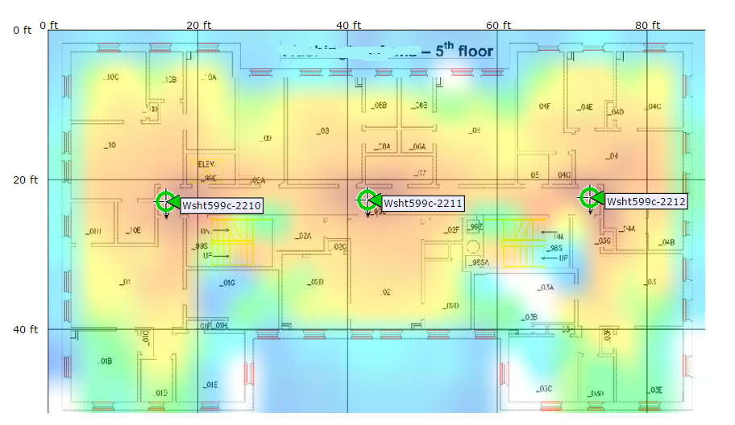

# too_short
The too_short in time project for IoT

Vous êtes dans un aéroport et vous vous baladez dans les boutiques pendant votre escale.

Bien sûr l'aeroport est gavé de bornes wifi mais il est aussi compartimenté en zones
de sécurité. Qui dit zones de sécurité dit portiques et qui dit portiques dit file d'attentes.

Le problème qui se pose est le suivant : compte tenu de votre position actuelle dans l'aeroport
aurez vous le temps de rejoindre votre porte d'embarquement.
La réponse n'est pas forcément oui ou non, ca peut être plus nuancé du vert au rouge !

L'objet porté par le voyageur doit collaborer avec un service de l'aeroport permettant d'acceder 
aux horaires des vols et aux objets mesurant le temps d'attente aux portiques. 
Il doit aussi participer à sa géolocalisation grâc eà la triangulation Wifi.

Cet objet pourrait aussi indiquer le chemin "le plus court" pour atteindre la porte d'embarquement.

C'est un projet complexe. Un gros travail préalable sera de SIMPLIFER pour essayer de garder l'esprit 
du sujet SANS se perdre dans des tâches non maîtrisées.

